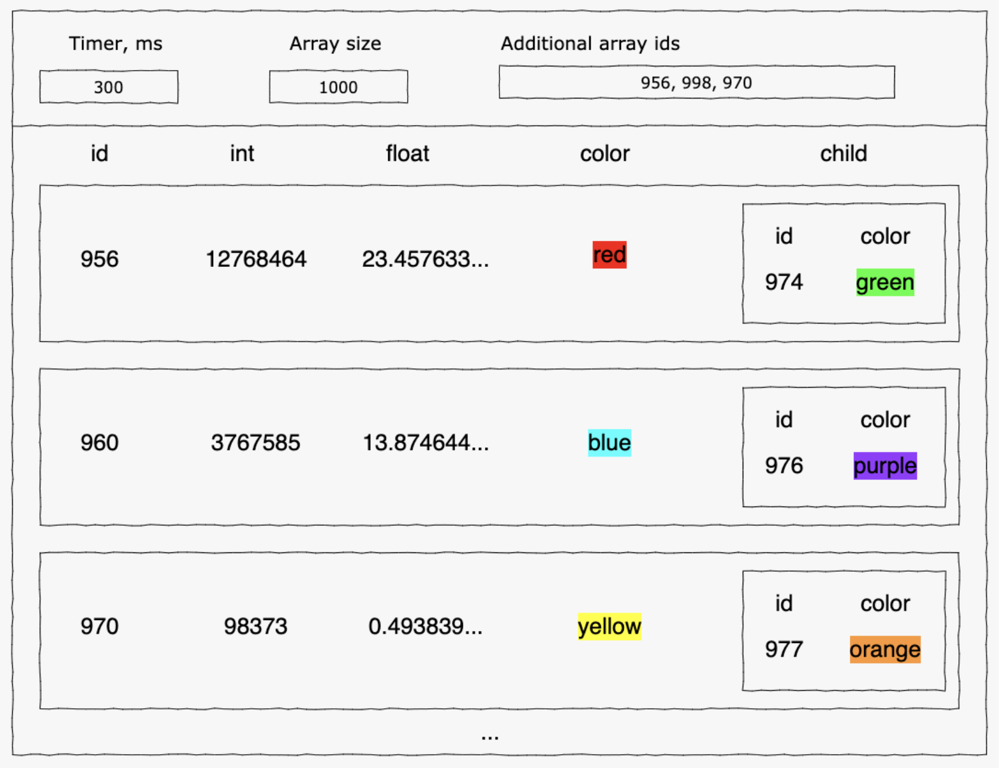

# Angular Test Task for B2Broker

This project was generated with [Angular CLI](https://github.com/angular/angular-cli) version 13.3.10.

## Test

Create a SPA application that receives large amounts of data with high frequency. The data should be received in the web-worker from a pseudo-socket and passed to the main thread. The main thread should render the incoming data in the amount of the last 10 elements.

### Requirements:

1. Make a pseudo-socket through a timer.Take into account the ability to change
   the value of the timer interval through the UI (input), in ms
2. The size of the data array coming from the pseudo-socket can be adjusted via
   the UI (input)
3. A single array element is an object that has the following fields:
   - a. id - string field
   - b. int - integer field
   - c. float - float field (precision === 18)
   - d. color - string field with color name (can be in any representation rgb,
   hex, string)
   - e. child - field which is an object that has two fields - id and color
4. The last 10 elements (they will be displayed in the UI) may contain their own set of ids, which can be set in the UI
5. In the main thread, you need to use not raw objects, but classes that are created based on the models described in step 3
6. In the UI, it is required to display data in the following representation:
   - a. each element is a table row
   - b. fields are columns
   - c. child is a nested table
   When rendering the color column, it is necessary to fill its background with the color specified in the field

### Technologies and libraries:

1. angular 13
2. class-transformer (https://www.npmjs.com/package/class-transformer) - to
   convert raw objects to classes
3. web-worker

### The main points when checking the test:

1. compliance with the specified requirements
2. use of specified technologies and libraries
3. performance (under different given conditions)
4. decomposition of code entities

### Will be a plus:

1. Using design patterns

## Development server

Run `ng serve` for a dev server. Navigate to `http://localhost:4200/`. The app will automatically reload if you change any of the source files.

## Build

Run `ng build` to build the project. The build artifacts will be stored in the `dist/` directory.
